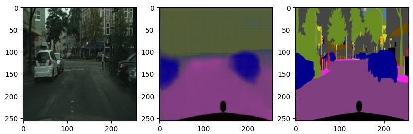
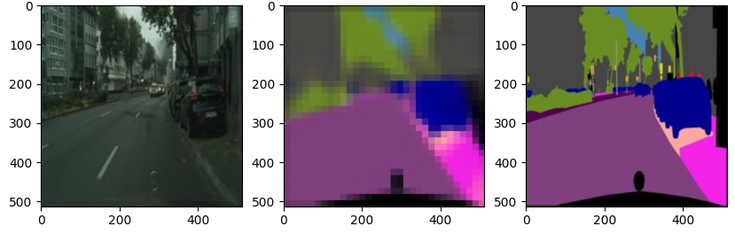
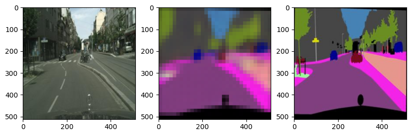
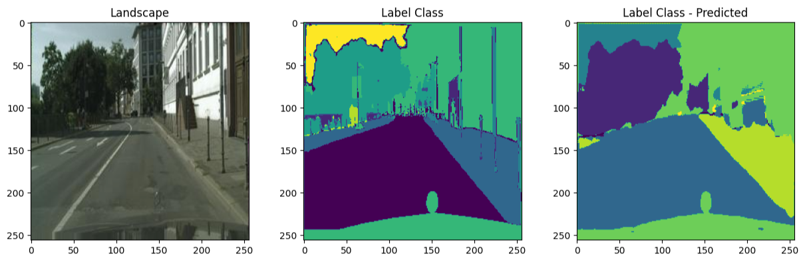
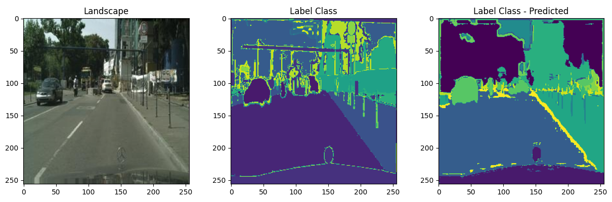
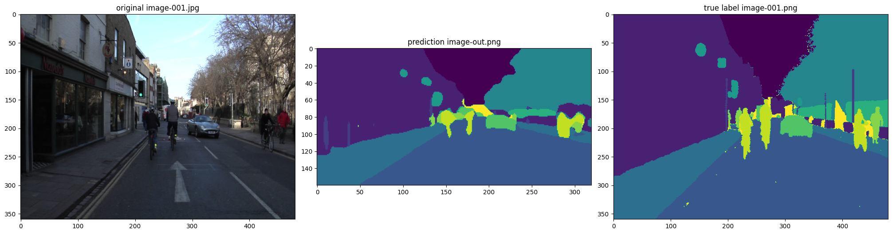
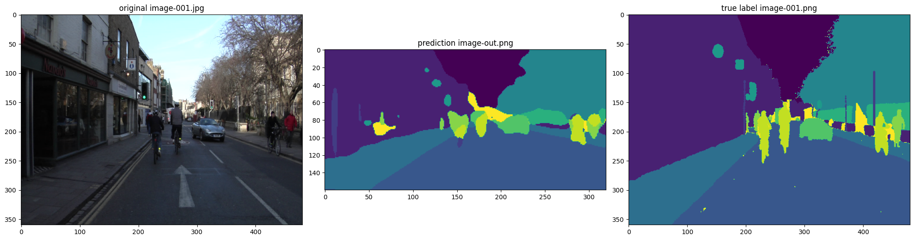
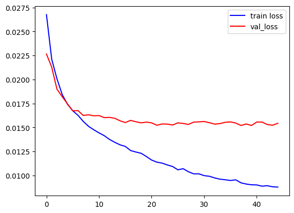
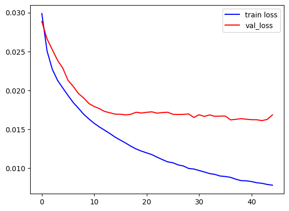

# CV_Project 2

## Comparative Analysis of Image Segmentation 

### Overview
Image segmentation is an important problem in computer vision that involves dividing an image into meaningful regions or objects. In this report, we provide an overview of the different techniques and algorithms used for image seg-mentation where we apply a comparative analysis of differ-ent deep learning methods. We modified the U-Net standard architecture and compared these architectures. We have also generated image labels for this segmentation process.

Name of Students:
1. Vandita Agarwal(M20MA208)
2. Shilajit Banerjee(M22CS062)
3. Dattatreyo Roy(M22CS060)

### Approaches used and Results:
1. Using the Original U-NET Architecture: The U-NET architecture is a popular deep learning architecture for image segmentation that was introduced in 2015. It consists of a contracting path that down samples the image and a symmetric expanding path that up samples the image.

   
 

2. Using the DenseNet121 Model along with the U-NET architecture: DenseNet is another deep learning architecture that has shown good performance for image segmentation. In this approach, the DenseNet121 model is used as the backbone for the U-NET architecture.  

   
 
 
3. Using the RESNET50 Model along with the U-NET architecture: This method uses the RESNET50 model as the backbone for the U-NET architecture. 

   
 
 

4. Segmentation with K-means clustering and U-NET architecture: This approach combines the K-means clustering method with the U-NET architecture to perform image segmentation. The K-means algorithm is used to cluster the labels in the image into different regions, and then the U-NET model is trained to segment each region.

   
 
 

5. Segmentation with DBSCAN clustering and U-NET architecture: This approach combines the DBSCAN clustering method with the U-NET architecture to perform image segmentation. The DBSCAN algorithm is used to cluster the labels in the image into different regions, and then the U-NET model is trained to segment each region.

   
 
 

6. SegNET with VGG16 Architecture: SegNET is another deep learning architecture that is specifically designed for image segmentation. It consists of an encoder network that downsamples the image and a decoder network that upsamples the image. The architecture uses pooling indices from the encoder network to perform upsampling in the decoder network. In this case VGG16  is used as backbone.

   
 
 
7. SegNET with Mobilenet Architecture: In this architecture of Segnet, Mobilenet is used as backbone.

   
 
 

### Evaluation Metrics: 

Here is the loss plot of Densenet with UNET model:

   
 
 
Here is the loss plot of Resnet with UNET model:

   
 
 
 
 For the evaluation, we have found out the IOU score, Dice score and the Hausdorff distance.
 
 | Model | Avg IOU score | Med IOU score | Avg Dice score | Med Dice score | Avg Hausdorff distance | Med Hausdorff distance |
| --- | --- | --- | --- | --- | --- | --- |
| Segmentation with normal UNET Architecture | 0.4157 | 0.4189 | 0.325 | 0.302 | 46.281 | 42.168 |
| Segmentation with DenseNet121 and UNet Architecture | 0.9382 | 0.9408 | 0.453 | 0.413 | 31.138 | 29.176 |
| Segmentation with Resnet50 and UNet Architecture | 0.8082 | 0.8109 | 0.438 | 0.426 | 25.689 | 30.256 |
| Segmentation with Kmeans and UNet Architecture | 0.6882 | 0.6908 | 0.312 | 0.296 | 41.544 | 43.514 |
| Segmentation with DBSCAN and UNet Architecture | 0.4182 | 0.4203 | 0.296 | 0.215 | 45.148 | 47.134 |

### Conclusion:
Image segmentation is a crucial task in computer vision, and various approaches have been proposed in recent years. Deep learning-based approaches, such as fully convolutional networks and semantic segmentation, have shown promising results in accurately segmenting images. In this project, two approaches have been explored: K-Nearest Neighbors and Semantic Segmentation using DeepLab. Preliminary results indicate that both approaches have their strengths and weaknesses and require further experimentation and evaluation. As for future work, exploring other deep learning-based approaches and evaluating their performance on the given dataset would be beneficial.
